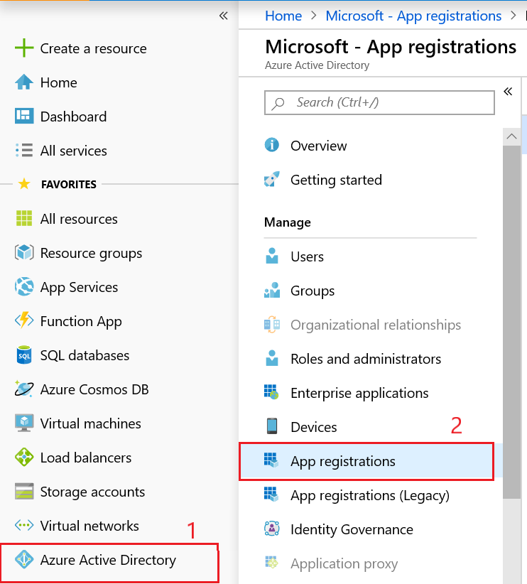
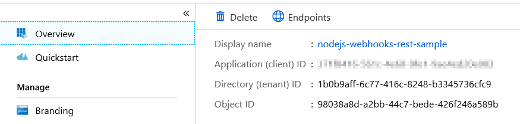
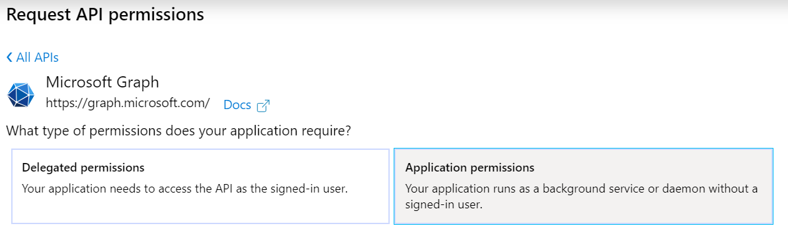
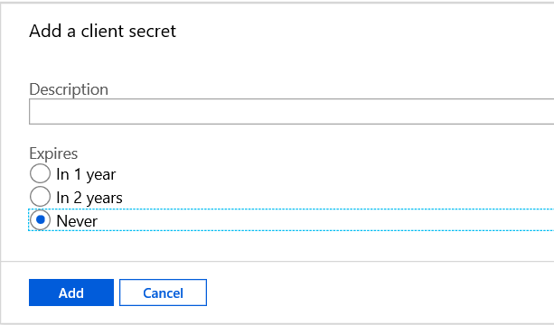

# Microsoft Graph SignIn logs download sample for Node.js

## Table Of Contents. ##
* [Introduction](#introduction)

* [Prerequisites](#prerequisites)

* [Register the app](#Register-the-app)

* [Configure and run the app](#Configure-and-run-the-web-app)

* [Questions and Comments](#Questions-and-Comments)

* [Additional resources](#Additional-resources)


## Introduction
<a name="introduction"></a>

This Node.js sample shows how to download AAD sign-in logs from Microsoft Graph. 

- Sign-in to get an access token.
- Use the access token to download AAD Signin logs, once page at a time.


## Prerequisites
<a name="prerequisites"></a>

To use the Webhook sample, you need the following:

- [Node.js](https://nodejs.org/) version 4 or 5.
- A [work or school account](http://dev.office.com/devprogram).

## Register the app
<a name="Register-the-app"></a>

This app uses the Azure AD endpoint, so you'll register it in the [Azure Portal](https://ms.portal.azure.com/#blade/Microsoft_AAD_IAM/ApplicationsListBlade).

1. Sign in to the Azure portal using either a work or school account or a personal Microsoft account.
1. If your account gives you access to more than one tenant, select your account in the top right corner, and set your portal session to the desired Azure AD tenant (using Switch Directory).
1. In the left-hand navigation pane, select the **Azure Active Directory service** , and then select **App registrations.**


1. Choose **New application registration**.

    1. Enter a friendly name for the application.
    1. Choose 'Web app/API' as the **Application Type**.
    1. Enter `http://localhost:3000/callback` for the **Sign-on URL**.
    1. In the Supported account types section, select Accounts in any organizational directory and personal Microsoft accounts (e.g. Skype, Xbox, Outlook.com).
    1. Click **Create**.

1. Choose your new application from the list of registered applications.
On the app **Overview** page, find the **Application (client) ID** value and record it for later. You'll need it to configure the configuration file for this project. 

1. Configure permissions for your application:

    1. Choose **Settings** > **Required permissions** > **Add**.
    1. Choose **Select an API** > **Microsoft Graph**, and then click **Select**.
    1. Choose **Select permissions**, scroll down to **Application Permissions**, choose **AuditLog.Read.All** and **Directory.Read.All**, and then click **Select**.
    1. Click **Done**.
    

1. Select **Certificates & secrets** under **Manage**. Select the **New client secret** button. Enter a value in Description and select one of the options for Expires and choose **Add.**



1. **Important**: Copy the key value--this is your app's secret. You won't be able to access this value again after you leave this blade.

You'll use the **application ID** and **secret** to configure the app.

## Configure and run the app

1. Use a text editor to open `constants.js`.
1. Replace `ENTER_YOUR_TENANT_ID` with the tenant ID of your Azure AD tenant. 
1. Replace `ENTER_YOUR_CLIENT_ID` with the client ID of your registered Azure application.
1. Replace `ENTER_YOUR_SECRET` with the client secret of your registered Azure application.
1. Install the dependencies running the following command:

    ```Shell
    npm install
    ```

1. Start the application with the following command:

    ```Shell
    npm start
    ```
    
## Questions and comments

Microsoft Graph development questions? Post them to [Stack Overflow](http://stackoverflow.com/questions/tagged/microsoft-graph). Make sure to tag your questions or comments with [Office365] and [API].

## Additional resources

- [Overview of Microsoft Graph](http://graph.microsoft.io/)
- [Subscription reference documentation](https://graph.microsoft.io/en-us/docs/api-reference/beta/resources/subscription)

## Copyright

Copyright (c) 2020 Microsoft. All rights reserved.